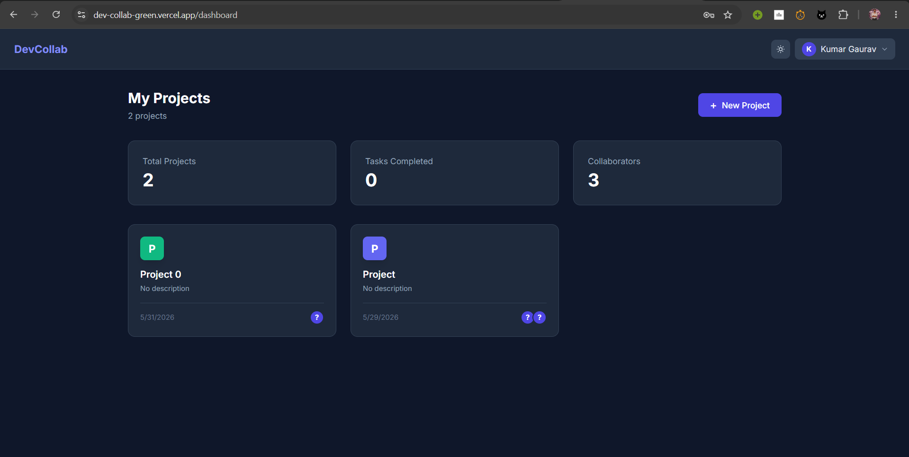

# DevCollab 🚀

A real-time collaborative development platform with AI-powered tools built with the MERN stack.

🔗 **Live Demo:** https://dev-collab-green.vercel.app/
🔧 **Backend API:** https://devcollab-a2s0.onrender.com

---

## ✨ Features

### 🔐 Authentication

- JWT-based register and login
- Protected routes
- Password change from profile

### 📋 Kanban Board

- Create and manage projects
- Drag and drop tasks across columns (To Do → In Progress → Review → Done)
- Task priority levels (Low, Medium, High)
- Real-time sync — see teammates' changes instantly

### 🤖 AI Features (Powered by Groq)

- **AI Task Generator** — describe your project, AI creates 8-10 tasks automatically
- **AI Code Reviewer** — get instant feedback on code quality, bugs, and improvements
- **AI Code Explainer** — understand any code block in plain English

### 💻 Code Editor

- Monaco Editor (same as VS Code) embedded in the browser
- Multi-language support: JavaScript, Python, Java, C++, C
- In-browser JavaScript execution via Web Workers
- AI review panel side by side with the editor

### 👥 Team Collaboration

- Invite teammates by email
- Role-based access (Owner, Collaborator, Viewer)
- Activity feed showing all team actions
- Real-time updates via Socket.io

### 👤 Profile

- Edit name, bio, skills
- View stats (projects, tasks, collaborators)
- Change password

---

## 🛠 Tech Stack

| Layer       | Technology                           |
| ----------- | ------------------------------------ |
| Frontend    | React 18, Vite, Tailwind CSS         |
| Backend     | Node.js, Express.js                  |
| Database    | MongoDB Atlas                        |
| Realtime    | Socket.io                            |
| AI          | Groq API (Llama 3.3)                 |
| Editor      | Monaco Editor                        |
| Drag & Drop | @hello-pangea/dnd                    |
| Auth        | JWT + bcryptjs                       |
| Deploy      | Vercel (frontend) + Render (backend) |

---

## 📁 Project Structure

devcollab/
├── frontend/ # React + Vite
│ ├── src/
│ │ ├── components/ # Reusable UI components
│ │ │ ├── AIPanel.jsx
│ │ │ ├── AITaskGenerator.jsx
│ │ │ ├── ActivityFeed.jsx
│ │ │ ├── CreateProjectModal.jsx
│ │ │ ├── CreateTaskModal.jsx
│ │ │ ├── MembersPanel.jsx
│ │ │ ├── Navbar.jsx
│ │ │ ├── PrivateRoute.jsx
│ │ │ ├── Skeleton.jsx
│ │ │ └── Toast.jsx
│ │ ├── context/ # React context
│ │ │ ├── AuthContext.jsx
│ │ │ └── ThemeContext.jsx
│ │ ├── hooks/ # Custom hooks
│ │ │ ├── useProjects.js
│ │ │ ├── useSocket.js
│ │ │ └── useTasks.js
│ │ ├── pages/ # Route pages
│ │ │ ├── CodeEditor.jsx
│ │ │ ├── Dashboard.jsx
│ │ │ ├── Login.jsx
│ │ │ ├── Profile.jsx
│ │ │ ├── ProjectBoard.jsx
│ │ │ └── Register.jsx
│ │ └── utils/
│ │ ├── api.js
│ │ └── codeRunner.js
└── backend/ # Node + Express
├── config/
│ └── db.js
├── controllers/
│ ├── activityController.js
│ ├── aiController.js
│ ├── authController.js
│ ├── memberController.js
│ ├── projectController.js
│ ├── taskController.js
│ └── userController.js
├── middleware/
│ └── authMiddleware.js
├── models/
│ ├── Activity.js
│ ├── Project.js
│ ├── Task.js
│ └── User.js
└── routes/
├── aiRoutes.js
├── authRoutes.js
├── projectRoutes.js
└── userRoutes.js

---

## 🚀 Getting Started

### Prerequisites

- Node.js v18+
- MongoDB Atlas account
- Groq API key (free at console.groq.com)

### Installation

```bash
# Clone the repo
git clone https://github.com/kumargauravmnnita/devcollab.git
cd devcollab
```

### Backend setup

```bash
cd backend
npm install
```

Create `backend/.env`:
PORT=5000
MONGO_URI=your_mongodb_connection_string
JWT_SECRET=your_jwt_secret_key
GROQ_API_KEY=your_groq_api_key
FRONTEND_URL=http://localhost:5173

### Frontend setup

```bash
cd backend
npm install
npm run dev
```

### Frontend setup

```bash
cd frontend
npm install
npm run dev
```

## 🌐 Deployment

| Service  | Platform      | URL                                  |
| -------- | ------------- | ------------------------------------ |
| Frontend | Vercel        | https://dev-collab-green.vercel.app/ |
| Backend  | Render        | https://devcollab-a2s0.onrender.com  |
| Database | MongoDB Atlas | Cloud hosted                         |

---

## 📸 Screenshots

> Dashboard — manage all your projects at a glance
> 
> Kanban Board — drag and drop tasks with real-time sync
> 
> AI Task Generator — describe your project, get tasks instantly
> 
> Code Editor — Monaco editor with AI review panel
> 

> AI Code Reviewer - Review your code
> 

> Activity Feed
> 

> Invite Team Members
> 

## 🤝 Contributing

Pull requests are welcome. For major changes please open an issue first.

---

## 📄 License

MIT © Kumar Gaurav — MNNIT Allahabad
